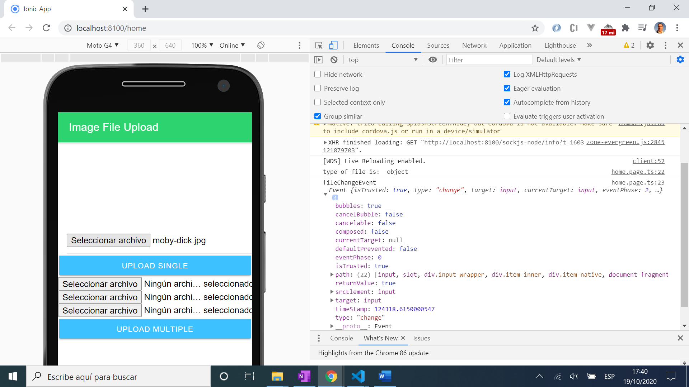

# :zap: Node File Upload

* Uploads image files selected by the user from an Ionic frontend to a Node.js backend folder.

**Note:** to open web links in a new window use: _ctrl+click on link_

## :page_facing_up: Table of contents

* [:zap: Node File Upload](#zap-node-file-upload)
	* [:page_facing_up: Table of contents](#page_facing_up-table-of-contents)
	* [:books: General info](#books-general-info)
	* [:camera: Screenshots](#camera-screenshots)
	* [:signal_strength: Technologies](#signal_strength-technologies)
	* [:floppy_disk: Setup](#floppy_disk-setup)
	* [:computer: Code Examples](#computer-code-examples)
	* [:cool: Features](#cool-features)
	* [:clipboard: Status & To-Do List](#clipboard-status--to-do-list)
	* [:clap: Inspiration](#clap-inspiration)
	* [:envelope: Contact](#envelope-contact)

## :books: General info

* Very simple backend using node with express and multer to load image files.
* Client frontend uses Ionic-Angular to show user controls to upload file from PC file system.

## :camera: Screenshots



## :signal_strength: Technologies

**Frontends:**

* [Ionic v5](https://ionicframework.com/)
* [Angular v10](https://angular.io/)
* [ionic/angular v5](https://www.npmjs.com/package/@ionic/angular) angular building blocks for Ionic
* [ionic/react v5](https://www.npmjs.com/package/@ionic/react) react building blocks for Ionic

**Backend:**

* [body parser](https://www.npmjs.com/package/body-parser) Node.js body parsing middleware
* [cors](https://www.npmjs.com/package/cors) Cross Origin Resource Sharing Connect/Express middleware
* [Express v4](https://expressjs.com/) Node.js middleware
* [Morgan v1](https://www.npmjs.com/package/morgan) HTTP request logger middleware for node.js
* [Multer v1](https://www.npmjs.com/package/multer) Middleware for handling `multipart/form-data`.
* [Busboy](https://github.com/mscdex/busboy) used by Multer as a streaming parser for HTML form data for node.js

## :floppy_disk: Setup

**/Ionic-Angular & /Ionic-React Frontends:**

* Run `npm i` to install dependencies
* Run `ionic serve` & navigate to `http://localhost:8080/` or `ng serve` & navigate to `http://localhost:4200/` to run server. The app will automatically reload if you change any of the source files.

**/server-express Backend:**

* Run `node index.js` for a node.js server. Backend does not update automatically as nodemon not used

## :computer: Code Examples

* Extract from `server-express/index.js` to show use of dependencies and posting of objects to uploads folder.

```javascript
app.use(cors());
app.use(morgan('combined'));
app.use(bodyParser.json());
app.use(bodyParser.urlencoded({ extended: true }));

app.post('/uploads', upload.array('photos[]'), (req, res) => {
	console.log('req.files: ', req.files);
	console.log('res: ', res);
});
```

## :cool: Features

* Tutorial shows a number of different front-ends that can be used to pass objects to the backend
* Backend 'uploads' folder is automically created if it does not exist already.

## :clipboard: Status & To-Do List

* Status: Working.
* To-Do: This is a very simple app. It is possible to upload the same photo multiple times - could add a check if photo/title exists already. Add commenting.

## :clap: Inspiration

* [Joshua Morony: Youtube: How to upload files to a server with Ionic](https://www.youtube.com/watch?v=tcWTl7tBT5E&ck_subscriber_id=433042050)

## :envelope: Contact

* Repo created by [ABateman](https://www.andrewbateman.org) - you are welcome to [send me a message](https://andrewbateman.org/contact)
